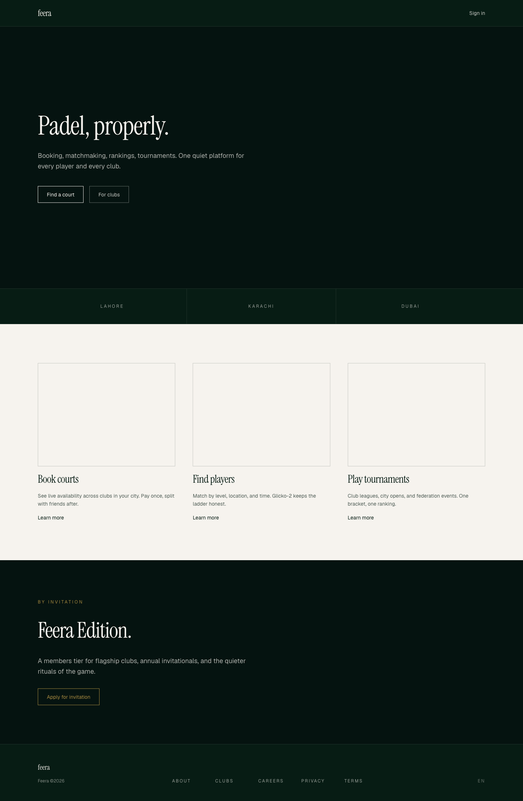

# Feera



Padel social network and ecosystem platform. Launching in Pakistan and the Gulf, built for global scale.

Two-tier brand:

- **Feera** (feera.ai): consumer platform, booking, matchmaking, rankings, coaching, tournaments, B2B SaaS.
- **Feera Edition** (feera.ai/edition): invitation-only members tier, flagship clubs, annual invitational, editorial brand.

## Stack

| Layer | Tech |
|---|---|
| Web | Next.js 16 (App Router), TypeScript strict, Tailwind v4, next-intl |
| Mobile | Expo SDK 52, expo-router, NativeWind, i18next |
| Admin | Next.js 16 (access-controlled at admin.feera.ai) |
| DB | Neon Postgres (`aws-eu-central-1` Frankfurt, target) + Drizzle ORM + RLS |
| Auth | better-auth + Twilio Verify (phone + WhatsApp OTP) + Resend magic links + Google/Apple OAuth |
| Payments | Stripe + JazzCash + Easypaisa + Raast (Phase 1 live); Checkout.com + Mada + Tabby (stubs) |
| Notifications | Expo Push + Twilio WhatsApp + Twilio SMS + Resend + OneSignal |
| Realtime | Soketi (self-hosted, Pusher protocol) |
| Storage | **Cloudflare R2** (zero egress) at `cdn.feera.ai`. Hetzner Object Storage retained as regional fallback. |
| Maps | Mapbox (primary), Google Maps fallback |
| Observability | Sentry + self-hosted PostHog + Metabase |
| Rating engine | Glicko-2 (custom impl in `packages/matching`) |
| Hosting | **Hetzner CPX21 Falkenstein DE `46.225.157.75`** — Docker Compose + Caddy edge. EAS for mobile builds. |

## Repository layout

```
apps/
  web/         Marketing site + club admin dashboard + public SEO + /edition microsite
  mobile/      Player app (iOS/Android via Expo)
  admin/       Internal Feera team ops tool
packages/
  db/          Drizzle schema + migrations + RLS policies
  ui/          Design system (web + native)
  i18n/        Translation keys + loaders
  payments/    Provider adapters + PaymentRouter
  matching/    Glicko-2 + partner-matching + tournament engine
  notifications/  Push + WhatsApp + SMS + email
  federations/ PPF, FIP, SPC, UAEPA adapters
  analytics/   PostHog + Mixpanel wrappers
  types/       Shared types
  config/      Shared ESLint, TS, Tailwind, Prettier
services/
  workers/         Background jobs (rating recalc, payment recon, etc.)
  hermes-skills/   Hermes Agent skills for ops
docs/
  decisions/   ADRs
  api/         OpenAPI specs
  runbooks/    Deployment + on-call
  brand/       Visual identity tokens + voice
  kpis/        Product metrics definitions
```

## Getting started

Prereqs: Node 22+, pnpm 10+.

```bash
pnpm install
cp .env.example .env.local           # fill from Doppler or Vercel env pull
pnpm dev                              # runs all apps via turbo
```

Per-app:

```bash
pnpm --filter @feera/web dev
pnpm --filter @feera/mobile dev
pnpm --filter @feera/admin dev
```

## Workflow

1. Every meaningful change → conventional commit on a feature branch.
2. Tests run before commit (husky + lint-staged + affected tests).
3. PR to `main` with CI green (lint + typecheck + test + e2e).
4. ADR for any non-trivial decision in `docs/decisions/`.
5. Ambiguous product calls: pick most defensible option, document, proceed. Stop only on irreversible (paid signups, real money, region locks).

## Style hard rules

- No em-dashes in user-facing copy, docs, or comments.
- No underscores in file or directory names. kebab-case.
- TypeScript strict. No `any`. No `@ts-ignore` without comment + linked issue.
- RTL first-class: logical CSS properties only (`ms-4` not `ml-4`).
- WCAG 2.1 AA on web, equivalent on mobile. axe-core in CI.
- Perf: FCP < 1.8s on 3G web. App cold start < 2s on Samsung A-series.
- Never write the word that starts with C and ends with "onfidential".

## Milestones

See spec in `docs/spec.md` and checkpoint files at repo root (`CHECKPOINT-N.md`) after each milestone.
